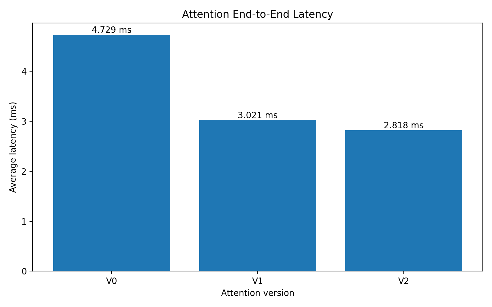
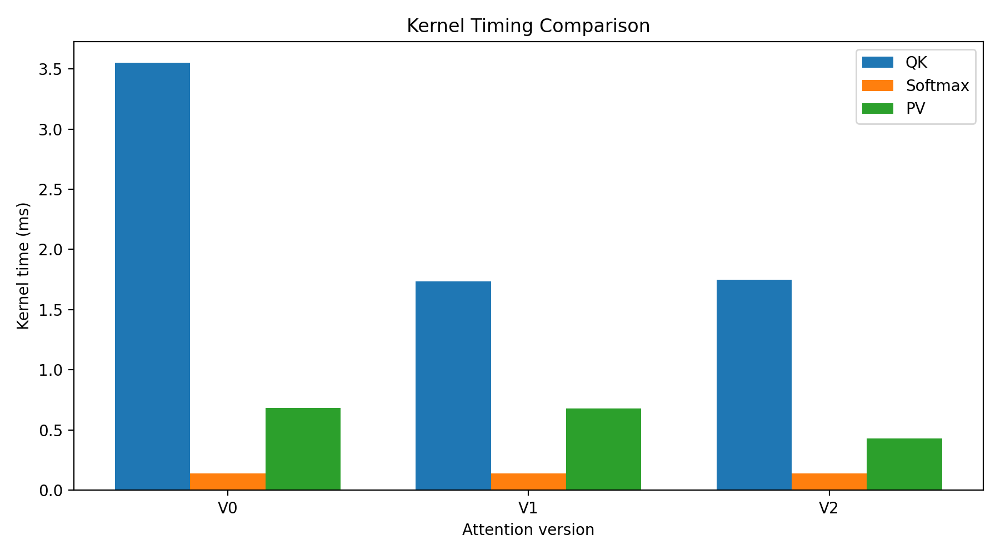
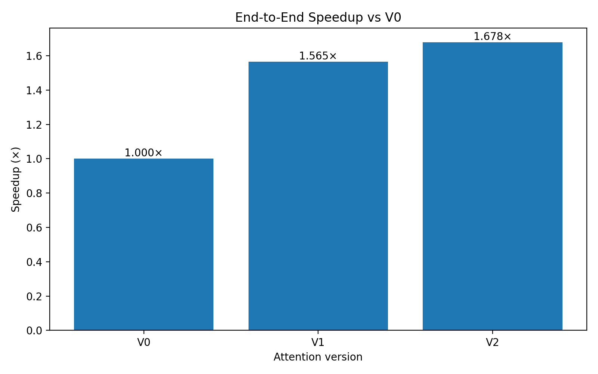
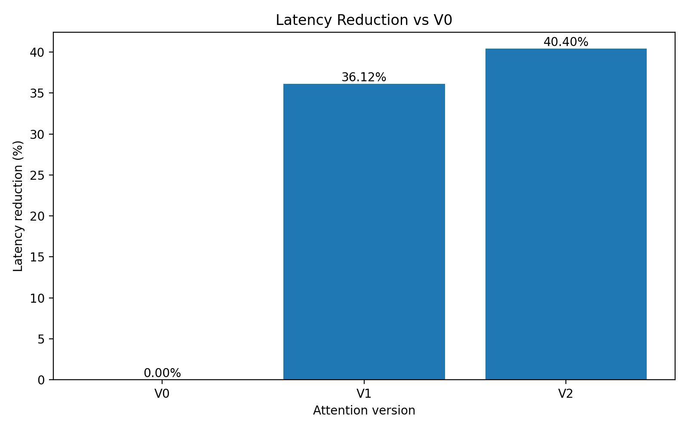
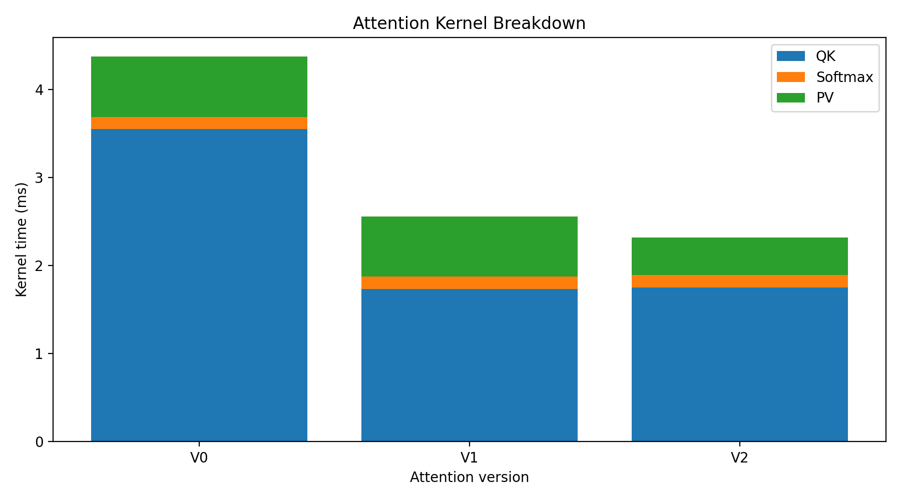
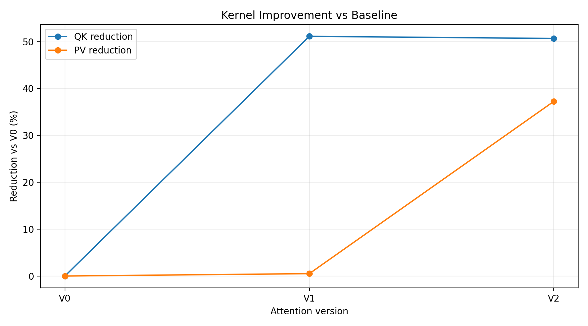
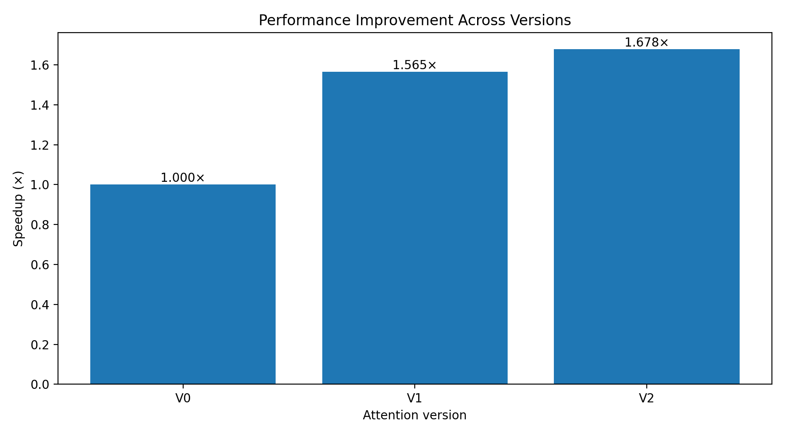

# ⚡ GPU Attention Performance — Shared-Memory Optimization in CUDA

A hands-on study of how **shared-memory tiling** speeds up the three kernels of scaled dot-product attention (QK → Softmax → PV) on an **NVIDIA Tesla T4**. Each optimization is a separate, measured, validated experiment, so you can see exactly what each change buys you.


---

## Summary (TL;DR)

| | Baseline (V0) | Best (V2) | Change |
|---|---:|---:|---:|
| **End-to-end latency** | 4.72884 ms | **2.81819 ms** | **−40.40%** |
| **Speedup** | 1.000× | **1.678×** | |
| **QK kernel** | 3.55002 ms | 1.75110 ms | −50.67% |
| **PV kernel** | 0.684278 ms | 0.429425 ms | −37.24% |
| **Max numerical error** | 5.37e-06 | 5.37e-06 | unchanged ✅ |

- **V1** tiles the **QK** kernel in shared memory → **1.565×** speedup (QK is the dominant cost).
- **V2** adds shared-memory tiling to the **PV** kernel → **1.678×** total speedup.
- All three versions pass validation against a CPU reference with the same max error (`5.37187e-06`).

---

## Background

Scaled dot-product attention for one head is:

```
Attention(Q, K, V) = softmax( Q·Kᵀ / √d ) · V
```

This project implements it as **three separate CUDA kernels**:

| Stage | Kernel | Computes | Shape (per head) |
|---|---|---|---|
| 1 | `qkKernel` | `scores = (Q·Kᵀ) / √64` | `[512 × 64] · [64 × 512] → [512 × 512]` |
| 2 | `softmaxKernel` | row-wise softmax of `scores` | `[512 × 512]` |
| 3 | `pvKernel` | `output = probs · V` | `[512 × 512] · [512 × 64] → [512 × 64]` |

The baseline reads every element straight from global memory with little data reuse. The experiments replace this with **16×16 shared-memory tiles**, which cuts redundant global-memory traffic.

---

## Experiments

| Version | Experiment | What changed | Source file |
|---|---|---|---|
| **V0** | Baseline | Naive QK, Softmax, PV (global memory only) | [`src/baseline/attention_baseline.cu`](src/baseline/attention_baseline.cu) |
| **V1** | QK shared memory | QK uses 16×64 shared tiles for Q and K | [`src/exp/attention_qk_shared_v1.cu`](src/exp/attention_qk_shared_v1.cu) |
| **V2** | QK + PV shared memory | V1 + PV uses 16×16 shared tiles for P and V | [`src/exp/attention_pv_shared_v2.cu`](src/exp/attention_pv_shared_v2.cu) |

Softmax is intentionally left unchanged in all versions, so any difference comes from QK and PV only.

### V0 — Baseline
Reference implementation. The **QK kernel dominates** (~75% of total time at 3.55 ms).

### V1 — QK shared-memory tiling
Q and K tiles are staged into `__shared__` memory (`q_shared[16][64]`, `k_shared[16][64]`) and reused by the threads in a block.
QK drops **3.55 ms → 1.73 ms (−51.13%)**, giving **1.565×** end-to-end.

### V2 — QK + PV shared-memory tiling
The PV kernel now loops over the sequence in 16-wide tiles (`PV_TILE = 16`), loading `P[i][j]` and `V[j][d]` into shared memory (`p_shared`, `v_shared`).
PV drops **0.681 ms → 0.429 ms (−37.24% vs V1)**, giving **1.678×** end-to-end.

> **Note:** QK in V2 (1.751 ms) vs V1 (1.735 ms) is the same kernel; the ~1% difference is run-to-run measurement noise. The V2 gain over V1 comes from the **PV** kernel.

---

## Benchmark Configuration

| Parameter | Value |
|---|---|
| GPU | NVIDIA Tesla T4 (compute capability 7.5) |
| Sequence length | 512 |
| Heads | 12 |
| Head dimension | 64 |
| Precision | FP16 (accumulation in FP32) |
| Scale factor | 1/√64 = 0.125 |
| Warm-up iterations | 20 |
| Timed iterations | 100 |
| Compiler flags | `nvcc -O3 -arch=sm_75` |

---

## Results

### Per-kernel timings

| Version | QK (ms) | Softmax (ms) | PV (ms) | Avg total (ms) | Speedup | Latency reduction |
|---|---:|---:|---:|---:|---:|---:|
| V0 | 3.55002 | 0.139611 | 0.684278 | 4.72884 | 1.000× | 0.00% |
| V1 | 1.73496 | 0.139923 | 0.680815 | 3.02066 | 1.565× | 36.12% |
| V2 | 1.75110 | 0.140719 | 0.429425 | 2.81819 | **1.678×** | **40.40%** |

### Validation

| Version | Max error | Status |
|---|---:|---|
| V0 | 5.37187e-06 | ✅ PASSED |
| V1 | 5.37187e-06 | ✅ PASSED |
| V2 | 5.37187e-06 | ✅ PASSED |

---

## Charts

### End-to-end latency


### Kernel timing comparison


### Speedup vs baseline (V0)


### Latency reduction vs baseline (V0)


### Kernel time breakdown (stacked)


### Per-kernel improvement


### Overall performance improvement


---

## Key Takeaways

1. **Attack the biggest kernel first.** QK was ~75% of baseline time, so optimizing it gave the largest single win (1.565×).
2. **Shared-memory tiling works.** Reusing Q/K and P/V tiles on-chip cut QK by ~51% and PV by ~37%.
3. **The bottleneck shifts.** After V2, QK is still ~62% of the runtime (1.75 ms of 2.82 ms), so it remains the best target for further work.
4. **Correctness is preserved.** Every version matches the CPU reference with the same max error.
5. **Softmax is not the problem.** It stays at ~0.14 ms (~5% of V2 runtime).

---

## Getting Started

### Requirements
- NVIDIA GPU (developed and measured on Tesla T4, `sm_75`)
- CUDA Toolkit with `nvcc`
- *(Optional)* Nsight Compute (`ncu`) for profiling
- *(Optional)* Python 3 with `pandas` and `matplotlib` to regenerate the charts

### Build and run

```bash
# V0 — baseline
nvcc -O3 -arch=sm_75 src/baseline/attention_baseline.cu -o attention_baseline
./attention_baseline

# V1 — QK shared memory
nvcc -O3 -arch=sm_75 src/exp/attention_qk_shared_v1.cu -o attention_qk_shared_v1
./attention_qk_shared_v1

# V2 — QK + PV shared memory
nvcc -O3 -arch=sm_75 src/exp/attention_pv_shared_v2.cu -o attention_pv_shared_v2
./attention_pv_shared_v2
```

> Using a different GPU? Change `-arch=sm_75` to match your compute capability (for example `sm_80` for A100, `sm_86` for RTX 30-series).

### Profile with Nsight Compute

```bash
ncu --set full ./attention_baseline
```

### Run on Kaggle
The notebook [`notebooks/attention.ipynb`](notebooks/attention.ipynb) contains the exact build, run and analysis steps used to produce the results, executed on a Kaggle Tesla T4.

---

## Project Structure

```
gpu-attention-performance/
├── README.md
├── notebooks/
│   └── attention.ipynb                  # Experiments, benchmarks, plotting
├── src/
│   ├── baseline/
│   │   └── attention_baseline.cu        # V0: baseline kernels
│   └── exp/
│       ├── attention_qk_shared_v1.cu    # V1: QK shared-memory tiling
│       └── attention_pv_shared_v2.cu    # V2: QK + PV shared-memory tiling
└── attention_benchmark_results/
    ├── 01_end_to_end_latency.png        # Charts (01–07)
    ├── ...
    ├── 07_performance_improvement.png
    ├── attention_benchmark_report.md    # Written report
    ├── attention_benchmark_results.csv  # Full results table
    ├── attention_kernel_timings.csv     # Per-kernel timings
    ├── attention_comparison.csv         # V0/V1/V2 comparison
    ├── attention_configuration.csv      # Benchmark settings
    ├── attention_experiments.csv        # Experiment summary
    └── attention_validation.csv         # Correctness results
```

---

## Possible Next Steps

- **V3:** larger tiles or register blocking for the QK kernel (still the main bottleneck)
- **V4:** use **Tensor Cores** (WMMA / `mma.sync`) for QK and PV on the T4
- **V5:** vectorized loads (`half2` / `float4`) and bank-conflict-free shared-memory layouts
- **V6:** fuse QK + Softmax + PV into a single **FlashAttention-style** kernel to avoid writing the 512×512 score matrix to global memory
- Sweep sequence lengths (128–4096) and head counts to study scaling

---

## Data Files

All measurements are available as CSV in [`attention_benchmark_results/`](attention_benchmark_results/) so you can reproduce or re-plot the charts without re-running the GPU code.
