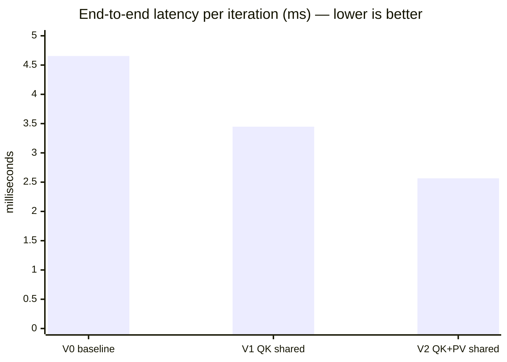
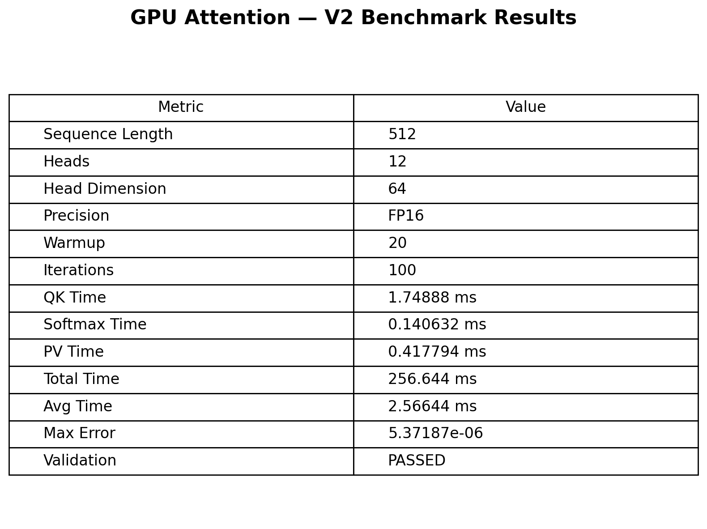
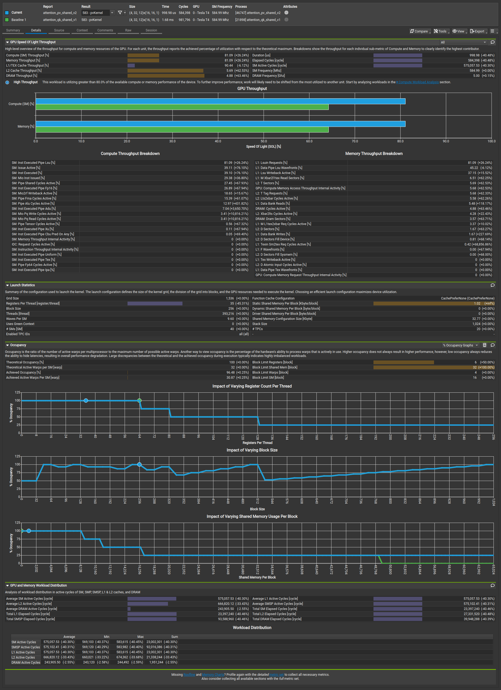

<div align="center">

# ⚡ GPU Attention Performance

**CUDA kernel optimization of scaled dot-product attention with shared-memory tiling — measured, validated and profiled on an NVIDIA Tesla T4**


[Results](#results) · [Compare versions](#comparing-versions) · [Profiling](#profiling-with-nsight-compute) · [Reliability](#measurement-reliability) · [Reproduce](#reproducing-the-results) · [Roadmap](#roadmap)

</div>

---

## Table of contents

1. [At a glance](#at-a-glance)
2. [Background](#background)
3. [Experiments](#experiments)
4. [Methodology and environment](#methodology-and-environment)
5. [Results](#results)
6. [Comparing versions](#comparing-versions)
7. [Measurement reliability](#measurement-reliability)
8. [Profiling with Nsight Compute](#profiling-with-nsight-compute)
9. [Bottleneck analysis](#bottleneck-analysis)
10. [Roadmap](#roadmap)
11. [Reproducing the results](#reproducing-the-results)
12. [Project structure and artifact index](#project-structure-and-artifact-index)
13. [Limitations](#limitations)
14. [Glossary](#glossary)

---

## At a glance

| | Baseline (V0) | Best (V2) | Change |
|---|---:|---:|---:|
| **End-to-end latency** | 4.65545 ms | **2.56644 ms** | **−44.87%** |
| **End-to-end speedup** | 1.00× | **1.81×** | |
| **QK kernel** | 3.57684 ms | 1.74888 ms | −51.11% |
| **Softmax kernel** | 0.140607 ms | 0.140632 ms | unchanged (by design) |
| **PV kernel** | 0.727831 ms | 0.417794 ms | −42.60% |
| **Max numerical error** | 5.37187e-06 | 5.37187e-06 | unchanged ✅ |



**Kernel time by version** (each `█` / `▒` / `░` ≈ 0.1 ms; QK = `█`, Softmax = `▒`, PV = `░`)

```
V0  ████████████████████████████████████▒░░░░░░░  4.45 ms
V1  █████████████████▒░░░░░░░  2.60 ms
V2  █████████████████▒░░░░  2.31 ms
```

- **V1** tiles the **QK** kernel in shared memory → **1.35×** end-to-end (QK was the dominant cost).
- **V2** also tiles the **PV** kernel → **1.81×** total, **1.34×** over V1.
- Every version passes validation against a CPU reference with the same max error.
- Nsight Compute profiles and side-by-side comparisons for every version are included in [`results/`](results/).

---

## Background

Scaled dot-product attention for one head:

```
Attention(Q, K, V) = softmax( Q·Kᵀ / √d ) · V
```

It is implemented here as **three separate CUDA kernels**:

| Stage | Kernel | Computes | Shape (per head) | Launch (block / grid) |
|---|---|---|---|---|
| 1 | `qkKernel` | `scores = (Q·Kᵀ) / √64` | `[512×64]·[64×512] → [512×512]` | 16×16 / 32×32×12 |
| 2 | `softmaxKernel` | row-wise softmax of `scores` | `[512×512]` | 256 / 512×12 |
| 3 | `pvKernel` | `output = probs · V` | `[512×512]·[512×64] → [512×64]` | 16×16 / 4×32×12 |

Across 12 heads the intermediate score matrix is `12 × 512 × 512` FP16 values ≈ **6.3 MB**, which is written to and read back from global memory between stages. The baseline reads every operand straight from global memory with no reuse between threads; the experiments stage operands in **shared-memory tiles** instead.

---

## Experiments

| Version | Experiment | What changed | Source |
|---|---|---|---|
| **V0** | Baseline | Naive QK, Softmax, PV (global memory only) | [`src/baseline/attention_baseline.cu`](src/baseline/attention_baseline.cu) |
| **V1** | QK shared memory | QK stages Q and K in `16×64` shared tiles | [`src/exp/attention_qk_shared_v1.cu`](src/exp/attention_qk_shared_v1.cu) |
| **V2** | QK + PV shared memory | V1 + PV stages P and V in `16×16` shared tiles (`PV_TILE = 16`) | [`src/exp/attention_pv_shared_v2.cu`](src/exp/attention_pv_shared_v2.cu) |

Softmax is intentionally identical in all versions, so any difference comes from QK and PV only.

| Version | QK kernel | Softmax kernel | PV kernel |
|---|---|---|---|
| V0 | global memory | unchanged | global memory |
| V1 | **shared tiles** (`q_shared[16][64]`, `k_shared[16][64]`) | unchanged | global memory |
| V2 | shared tiles (same as V1) | unchanged | **shared tiles** (`p_shared[16][16]`, `v_shared[16][16]`) |

- **V0 → V1:** QK drops **3.577 → 1.741 ms (−51.32%)**; end-to-end **1.35×**. PV is untouched.
- **V1 → V2:** PV drops **0.720 → 0.418 ms (−41.99%)**; end-to-end **1.34×** over V1 and **1.81×** over V0.
- QK is the *same code* in V1 and V2 (1.741 vs 1.749 ms); the ~0.5% difference is run-to-run noise.

---

## Methodology and environment

### Benchmark configuration

| Parameter | Value |
|---|---|
| Sequence length | 512 |
| Heads | 12 |
| Head dimension | 64 |
| Precision | FP16 storage, FP32 accumulation |
| Scale factor | 1/√64 = 0.125 |
| Warm-up iterations | 20 |
| Timed iterations | 100 |
| Validation | Compared against a CPU reference; max absolute error reported |
| Compile | `nvcc -O3 -arch=sm_75` |

### Environment of the official results

| Item | Value |
|---|---|
| Platform | Google Colab (see [`notebooks/google_notebook.ipynb`](notebooks/google_notebook.ipynb)) |
| GPU | NVIDIA Tesla T4, 15 GB, 70 W cap (compute capability 7.5, 40 SMs) |
| NVIDIA driver | 580.82.07 |
| CUDA (driver-reported) | 13.0 |
| Nsight Compute | 2025.3.1.0 |
| Date | 6 Oct 2026 |

### What the numbers mean

| Term | Definition |
|---|---|
| **Kernel time** (QK / Softmax / PV) | Time of that kernel as reported by the program |
| **Avg total** | Wall-clock time of one full QK → Softmax → PV iteration (includes launch / synchronization overhead, so it is ≥ the sum of kernel times) |
| **Speedup** | `Avg total(V0) / Avg total(Vn)` |
| **Reduction** | `1 − after / before` |
| **Profiled duration** | Kernel duration *under Nsight Compute* (clocks locked ≈ 585 MHz) — **only comparable between profiled runs, never to benchmark times** |

---

## Results

Raw program output for all versions is in [`results/result.md`](results/result.md).

### Per-kernel timings

| Version | QK (ms) | Softmax (ms) | PV (ms) | Sum of kernels (ms) | Avg total (ms) | Speedup vs V0 | Latency reduction vs V0 |
|---|---:|---:|---:|---:|---:|---:|---:|
| V0 | 3.57684 | 0.140607 | 0.727831 | 4.4453 | 4.65545 | 1.00× | — |
| V1 | 1.74121 | 0.140730 | 0.720315 | 2.6023 | 3.44829 | 1.35× | 25.93% |
| V2 | 1.74888 | 0.140632 | 0.417794 | 2.3073 | 2.56644 | **1.81×** | **44.87%** |

### Step-by-step improvement

| Step | Optimization | Avg time (ms) | Speedup vs previous | Reduction vs previous |
|---|---|---:|---:|---:|
| V0 → V1 | QK shared memory | 4.65545 → 3.44829 | 1.35× | 25.93% |
| V1 → V2 | PV shared memory | 3.44829 → 2.56644 | 1.34× | 25.57% |
| V0 → V2 | Both | 4.65545 → 2.56644 | **1.81×** | **44.87%** |

### Kernel-level improvements

| Comparison | Kernel | Before (ms) | After (ms) | Reduction |
|---|---|---:|---:|---:|
| V0 → V1 | QK | 3.57684 | 1.74121 | 51.32% |
| V1 → V2 | PV | 0.720315 | 0.417794 | 41.99% |
| V0 → V2 | QK | 3.57684 | 1.74888 | 51.11% |
| V0 → V2 | PV | 0.727831 | 0.417794 | 42.60% |

### Share of kernel time

| Version | QK | Softmax | PV |
|---|---:|---:|---:|
| V0 | 80.5% | 3.2% | 16.4% |
| V1 | 66.9% | 5.4% | 27.7% |
| V2 | 75.8% | 6.1% | 18.1% |

After V2, **QK is still about three quarters of kernel time** — it is the next target.

### Effective throughput (derived)

Each of QK and PV performs `2 × 12 × 512 × 512 × 64 ≈ 0.403 GFLOP`.

| Kernel | V0 | V2 | Gain |
|---|---:|---:|---:|
| QK | 113 GFLOP/s | 230 GFLOP/s | 2.0× |
| PV | 553 GFLOP/s | 964 GFLOP/s | 1.7× |

For context, a T4 peaks at roughly 8 TFLOP/s FP32 and 65 TFLOP/s FP16 on Tensor Cores (published specifications), so even V2 uses only a small fraction of the hardware — there is substantial headroom left.

### Validation

| Version | Max error | Status |
|---|---:|---|
| V0 | 5.37187e-06 | ✅ PASSED |
| V1 | 5.37187e-06 | ✅ PASSED |
| V2 | 5.37187e-06 | ✅ PASSED |

### Benchmark screenshots

| Version | Console output | Results table |
|---|---|---|
| V0 | [`v0_performance.png`](results/v0-baseline/v0_performance.png) | [`v0_benchmark_results.png`](results/v0-baseline/v0_benchmark_results.png) |
| V1 | [`v1_performance.png`](results/v1-qk-shared/v1_performance.png) | [`v1_benchmark_results.png`](results/v1-qk-shared/v1_benchmark_results.png) |
| V2 | [`v2_performance.png`](results/v2-qk-pv-shared/v2_performance.png) | [`v2_benchmark_results.png`](results/v2-qk-pv-shared/v2_benchmark_results.png) |

<p align="center">
  
</p>

---

## Comparing versions

### Side-by-side summary

| | V0 Baseline | V1 QK shared | V2 QK + PV shared |
|---|---:|---:|---:|
| QK (ms) | 3.57684 | **1.74121** | 1.74888 |
| Softmax (ms) | 0.140607 | 0.140730 | 0.140632 |
| PV (ms) | 0.727831 | 0.720315 | **0.417794** |
| Avg total (ms) | 4.65545 | 3.44829 | **2.56644** |
| Speedup vs V0 | 1.00× | 1.35× | **1.81×** |
| Speedup vs previous | — | 1.35× | 1.34× |
| Max error | 5.37e-06 | 5.37e-06 | 5.37e-06 |
| Registers / thread — QK | 52 | 33 | 33 |
| Registers / thread — PV | 64 | 64 | 35 |
| Static shared mem / block — QK | 0 | 4.10 KB | 4.10 KB |
| Static shared mem / block — PV | 0 | 0 | 1.02 KB |

*(Register and shared-memory figures come from the Nsight Compute launch statistics in [`results/comparisons/`](results/comparisons/).)*

### Which version should I use?

| Goal | Choose |
|---|---|
| Reference / correctness baseline | **V0** |
| Smallest change with the biggest single gain | **V1** (one kernel changed, 1.35×) |
| Best performance in this project | **V2** (1.81×) |

### Where each comparison lives

| You want to know… | Open |
|---|---|
| What QK tiling did to the hardware | [`comparisons/v0-v1/qk_kernel_details.png`](results/comparisons/v0-v1/qk_kernel_details.png) |
| What PV tiling did to the hardware | [`comparisons/v1-v2/pv_kernel_details.png`](results/comparisons/v1-v2/pv_kernel_details.png) |
| The total effect of both | [`comparisons/v0-v2/`](results/comparisons/v0-v2/) |
| Confirm QK did not change between V1 and V2 | [`comparisons/v1-v2/qk_kernel_details.png`](results/comparisons/v1-v2/qk_kernel_details.png) |

---

## Measurement reliability

Treat small differences with care. Two kinds of variation show up in the data.

### 1. Wall-clock overhead differs between runs

| Version | Sum of kernels | Avg total | Overhead (Colab, official) | Overhead (Kaggle, earlier run) |
|---|---:|---:|---:|---:|
| V0 | 4.4453 | 4.65545 | 0.21 ms | 0.36 ms |
| V1 | 2.6023 | 3.44829 | **0.85 ms** | 0.47 ms |
| V2 | 2.3073 | 2.56644 | 0.26 ms | 0.50 ms |

The kernel times barely move between runs, but the gap between kernel sum and wall-clock average varies from about 0.2 to 0.85 ms. V1's official average (3.448 ms) carries the largest gap, which is why its end-to-end speedup (1.35×) looks lower than its kernel-only speedup (1.71×).

### 2. Cross-run comparison (Colab vs earlier Kaggle run, same code)

| Version | Metric | Colab (official) | Kaggle (earlier) | Δ |
|---|---|---:|---:|---:|
| V0 | QK / PV / Avg (ms) | 3.577 / 0.728 / 4.655 | 3.550 / 0.684 / 4.729 | +0.8% / +6.4% / −1.6% |
| V1 | QK / PV / Avg (ms) | 1.741 / 0.720 / 3.448 | 1.735 / 0.681 / 3.021 | +0.4% / +5.8% / +14.2% |
| V2 | QK / PV / Avg (ms) | 1.749 / 0.418 / 2.566 | 1.751 / 0.429 / 2.818 | −0.1% / −2.7% / −8.9% |
| | **Speedup V1 / V2 vs V0** | **1.35× / 1.81×** | 1.57× / 1.68× | |

- **QK is very stable** across runs and platforms (within ~1%).
- **PV varies a few percent**; **end-to-end averages vary up to ~14%**.
- Across five V0 benchmark runs recorded in the notebooks, the average ranged from **4.32 to 4.87 ms (~13% spread)**. (Four came from the Kaggle notebook — the earliest three from a build without per-kernel timing, one of them launched through a blocked `ncu` — and one from the official Colab run, so treat this as an indicative range.)

**Conclusion:** the direction and the approximate size of the gains are reproducible — QK ≈ −51%, PV ≈ −40% to −43%, total speedup between about **1.7× and 1.8×** depending on run — but the second decimal of any end-to-end speedup is not meaningful. The official numbers in this document are those of one Colab run.

### Recommended practice for new measurements

- Run each version **at least 5 times** and report the **median** and min–max.
- Compare **kernel times** and **profiler metrics** for causal claims; use wall-clock averages for the overall picture.
- Keep GPU, driver and clocks identical when comparing versions.

---

## Profiling with Nsight Compute

Each version was profiled with `ncu --set basic`, and the reports are stored with their screenshots. Comparisons were created with Nsight Compute's **Compare** feature.

> ⚠️ **Profiler timings are not benchmark timings.** Under `ncu`, GPU clocks are locked (≈585 MHz) and kernels are replayed over multiple passes (9 passes per kernel here), so durations are much longer than in the normal run (for example V0 QK: 9.73 ms profiled vs 3.58 ms benchmarked). Use profiled values only to compare *between* profiled versions.

### How to read the comparison images

| Element | Meaning |
|---|---|
| Folder name `vA-vB` | **A = baseline** (green), **B = current** (blue). Percentages in brackets show change of *current* relative to *baseline*. |
| `qk_*` / `pv_*` | Which kernel is compared |
| `*_details.png` | Nsight **Details** page: Speed-of-Light throughput, launch statistics, occupancy, workload distribution |
| `*_sys.png` | Nsight **Summary** page: every kernel launch in the report with duration, throughput, registers, grid and block size |

### Per-kernel profile of V2 (from the Summary page)

| Kernel | Profiled duration | Compute throughput | Memory throughput | Registers / thread | Grid | Block |
|---|---:|---:|---:|---:|---|---|
| `qkKernel` | 4.75 ms | 9.01% | 49.86% | 33 | 32×32×12 | 16×16 |
| `softmaxKernel` | 0.35 ms | 75.89% | 75.89% | 18 | 512×12 | 256 |
| `pvKernel` | 1.00 ms | 81.09% | 81.09% | 35 | 4×32×12 | 16×16 |

(Throughput = % of peak sustained, Nsight "Speed of Light".)

### QK kernel — V0 → V1/V2

| Metric (Nsight) | V0 baseline | V1 / V2 | Change |
|---|---:|---:|---:|
| Duration | 9.73 ms | 4.75 ms | **−51.15%** |
| Compute (SM) throughput | ≈11.3% | 9.01% | −20.32% |
| Memory throughput | ≈49.9% | 49.87% | −0.10% |
| L1/TEX throughput | ≈99.8% | 99.7% | ≈ unchanged |
| Registers / thread | 52 | 33 | −36.54% |
| Static shared memory / block | 0 | 4.10 KB | new |
| Theoretical occupancy | 100% | 100% | — |
| Achieved occupancy | ≈98.3% | 97.9% | ≈ unchanged |

V1 and V2 profile identically for QK, as expected (same code).

### PV kernel — V0/V1 → V2

| Metric (Nsight) | V0 / V1 | V2 | Change |
|---|---:|---:|---:|
| Duration | 1.68 ms | 0.999 ms | **−40.48%** |
| Compute (SM) throughput | ≈64.3% | 81.09% | +26.04% |
| Memory throughput | ≈64.3% | 81.09% | +26.04% |
| L1/TEX throughput | ≈96.4% | 90.44% | −6.27% |
| Registers / thread | 64 | 35 | −45.31% |
| Static shared memory / block | 0 | 1.02 KB | new |
| Theoretical occupancy | 100% | 100% | — |
| Achieved occupancy | ≈96.2% | 96.48% | ≈ unchanged |

V0 and V1 profile the same for PV, as expected (unchanged kernel). Rows marked ≈ are derived from the deltas Nsight displays.

### Profile artifacts

| Version | Nsight Compute report | Console screenshot |
|---|---|---|
| V0 | `results/v0-baseline/attention_baseline.ncu-rep` | [`v0_ncu.png`](results/v0-baseline/v0_ncu.png) |
| V1 | `results/v1-qk-shared/attention_qk_shared_v1.ncu-rep` | [`v1_ncu.png`](results/v1-qk-shared/v1_ncu.png) |
| V2 | `results/v2-qk-pv-shared/attention_pv_shared_v2.ncu-rep` | [`v2_ncu.png`](results/v2-qk-pv-shared/v2_ncu.png) |

Open a `.ncu-rep` in the **Nsight Compute UI** (`ncu-ui`) for the full interactive report. To compare two reports yourself: open one, then use **Compare** (or *Add Baseline*) on the other.

### All comparison images

| Comparison | QK kernel | PV kernel |
|---|---|---|
| **V0 vs V1** | [details](results/comparisons/v0-v1/qk_kernel_details.png) · [summary](results/comparisons/v0-v1/qk_kernel_sys.png) | [details](results/comparisons/v0-v1/pv_kernel_details.png) · [summary](results/comparisons/v0-v1/pv_kernel_sys.png) |
| **V0 vs V2** | [details](results/comparisons/v0-v2/qk_kernel_details.png) · [summary](results/comparisons/v0-v2/qk_kernel_sys.png) | [details](results/comparisons/v0-v2/pv_kernel_details.png) · [summary](results/comparisons/v0-v2/pv_kernel_sys.png) |
| **V1 vs V2** | [details](results/comparisons/v1-v2/qk_kernel_details.png) · [summary](results/comparisons/v1-v2/qk_kernel_sys.png) | [details](results/comparisons/v1-v2/pv_kernel_details.png) · [summary](results/comparisons/v1-v2/pv_kernel_sys.png) |

Example — PV kernel, V1 (green) vs V2 (blue):

<p align="center">
  
</p>

---

## Bottleneck analysis

| Kernel | State after V2 | Evidence | Interpretation |
|---|---|---|---|
| **QK** | **Main bottleneck** (~76% of kernel time) | Compute 9.0%, memory 49.9% of peak; Nsight raises a *latency issue* flag (both below 60%); L1/TEX throughput ≈ 99.7% before and after | Time halved with the same L1/TEX utilization, so the kernel is still limited by on-chip load/store traffic and latency rather than by arithmetic or DRAM (DRAM throughput is under 1%) |
| **Softmax** | Healthy | 75.9% compute and memory throughput; ~6% of kernel time | Not worth optimizing before QK |
| **PV** | Well utilized | 81% compute and memory throughput; L1/TEX 90% | Nsight reports high throughput; further gains need a different approach (e.g. Tensor Cores), not more tiling |

Occupancy is not the limiter for QK or PV: theoretical occupancy is 100% and achieved occupancy is above 96% in every profile.

---

## Roadmap

Ordered by expected value.

| Priority | Idea | Why | Expected effect |
|---|---|---|---|
| 1 | **Tensor Cores** (WMMA / `mma.sync`) for QK and PV | Arithmetic currently uses CUDA-core FP32 math; T4 Tensor Cores offer far higher FP16 throughput | Large, especially for QK |
| 2 | **Vectorized loads** (`half2` / `float4`) and bank-conflict-free shared layouts | QK is bound by load/store traffic | Moderate |
| 3 | **Larger tiles / register blocking** for QK | More reuse per shared-memory load | Moderate |
| 4 | **Fuse QK + Softmax + PV** (FlashAttention-style) | Avoids writing and reading the ~6.3 MB score matrix through global memory | Large at longer sequence lengths |
| 5 | Profile with `--set full` | Stall reasons, bank conflicts, instruction mix | Guides 2 and 3 |
| 6 | Sweep sequence length (128–4096) and heads | Shows how gains scale | Documentation value |

---

## Reproducing the results

### Requirements
- NVIDIA GPU (developed and measured on Tesla T4, `sm_75`)
- CUDA Toolkit with `nvcc`
- *(Optional)* Nsight Compute (`ncu`, `ncu-ui`) for profiling and for opening `.ncu-rep` files
- *(Cloud)* On Colab, `ncu` counters work out of the box; on Kaggle they are blocked (`ERR_NVGPUCTRPERM`), which is why profiling was done on Colab

### Build and run

```bash
# V0 — baseline
nvcc -O3 -arch=sm_75 src/baseline/attention_baseline.cu -o attention_baseline
./attention_baseline

# V1 — QK shared memory
nvcc -O3 -arch=sm_75 src/exp/attention_qk_shared_v1.cu -o attention_qk_shared_v1
./attention_qk_shared_v1

# V2 — QK + PV shared memory
nvcc -O3 -arch=sm_75 src/exp/attention_pv_shared_v2.cu -o attention_pv_shared_v2
./attention_pv_shared_v2
```

> Different GPU? Change `-arch=sm_75` to your compute capability (for example `sm_80` for A100, `sm_86` for RTX 30-series).

### Repeat runs for a reliable number

```bash
for i in 1 2 3 4 5; do ./attention_pv_shared_v2 | grep "Avg Time"; done
```

### Profile

```bash
# Basic set, exported to a report you can open in the Nsight Compute UI
ncu --set basic --export attention_baseline ./attention_baseline

# Full metric set (slower, much more detail)
ncu --set full --export attention_baseline_full ./attention_baseline
```

### Notebooks

| Notebook | Platform | Purpose |
|---|---|---|
| [`notebooks/google_notebook.ipynb`](notebooks/google_notebook.ipynb) | Google Colab (Tesla T4) | Build, run and profile V0/V1/V2 — source of the official results and `.ncu-rep` files |
| [`notebooks/kaggle_notebook.ipynb`](notebooks/kaggle_notebook.ipynb) | Kaggle (Tesla T4) | Earlier benchmark runs and chart generation |

### Adding your own GPU to the comparison

Run all three versions and record:

| GPU | Version | QK (ms) | Softmax (ms) | PV (ms) | Avg total (ms) | Speedup vs V0 |
|---|---|---:|---:|---:|---:|---:|
| *your GPU* | V0 | | | | | 1.00× |
| *your GPU* | V1 | | | | | |
| *your GPU* | V2 | | | | | |

---

## Project structure and artifact index

```
gpu-attention-performance/
├── README.md
├── notebooks/
│   ├── google_notebook.ipynb            # Colab: build, run, Nsight Compute profiling
│   └── kaggle_notebook.ipynb            # Kaggle: earlier runs + chart generation
├── src/
│   ├── baseline/
│   │   └── attention_baseline.cu        # V0
│   └── exp/
│       ├── attention_qk_shared_v1.cu    # V1
│       └── attention_pv_shared_v2.cu    # V2
└── results/
    ├── result.md                        # Raw output + comparison tables
    ├── v0-baseline/                     # .ncu-rep + v0_{benchmark_results,ncu,performance}.png
    ├── v1-qk-shared/                    # .ncu-rep + v1_{benchmark_results,ncu,performance}.png
    ├── v2-qk-pv-shared/                 # .ncu-rep + v2_{benchmark_results,ncu,performance}.png
    └── comparisons/
        ├── v0-v1/                       # {qk,pv}_kernel_{details,sys}.png
        ├── v0-v2/
        └── v1-v2/
```

| Artifact | Count | Approx. size | Purpose |
|---|---:|---:|---|
| Source files (`.cu`) | 3 | ~19 KB each | The three versions |
| Notebooks | 2 | — | Reproduction |
| Nsight Compute reports (`.ncu-rep`) | 3 | ~27 MB each | Full profiles |
| Benchmark screenshots | 9 | < 120 KB each | Evidence for the reported times |
| Comparison images | 12 | 0.3–0.65 MB each | Hardware-level before/after |

> **Repository tip:** the three `.ncu-rep` files add up to ~83 MB. They are below GitHub's 100 MB per-file limit but make the repository heavy; consider [Git LFS](https://git-lfs.com) (`git lfs track "*.ncu-rep"`) or attaching them to a release.

---

## Limitations

- **Single GPU model and a single official run** — the V1 end-to-end figure in particular is sensitive to run-to-run overhead (see [Measurement reliability](#measurement-reliability)).
- **One problem size** — sequence length 512, 12 heads, head dimension 64.
- **Basic profile set** — `ncu --set basic` omits detailed stall and bank-conflict metrics; use `--set full` for root-cause work.
- **Derived values** — items marked ≈ or labeled *derived* are computed from displayed deltas or from the problem size, not read directly from a report.
- **Educational implementation** — three separate kernels with FP16 storage; not a replacement for a tuned library or FlashAttention.

---

## Glossary

| Term | Meaning |
|---|---|
| **QK / PV** | The two matrix multiplications of attention: `Q·Kᵀ` and `P·V` |
| **Shared memory** | Fast on-chip memory shared by the threads of a block |
| **Tiling** | Loading a small block of data into shared memory once and reusing it many times |
| **Occupancy** | Active warps per SM as a fraction of the maximum |
| **Speed of Light (SOL)** | Nsight's measure of how close a kernel is to the hardware's peak compute or memory throughput |
| **L1/TEX** | The SM's combined L1 data cache and texture pipeline |
| **`.ncu-rep`** | Nsight Compute report file |
| **Warm-up** | Untimed iterations run first to stabilize clocks and caches |